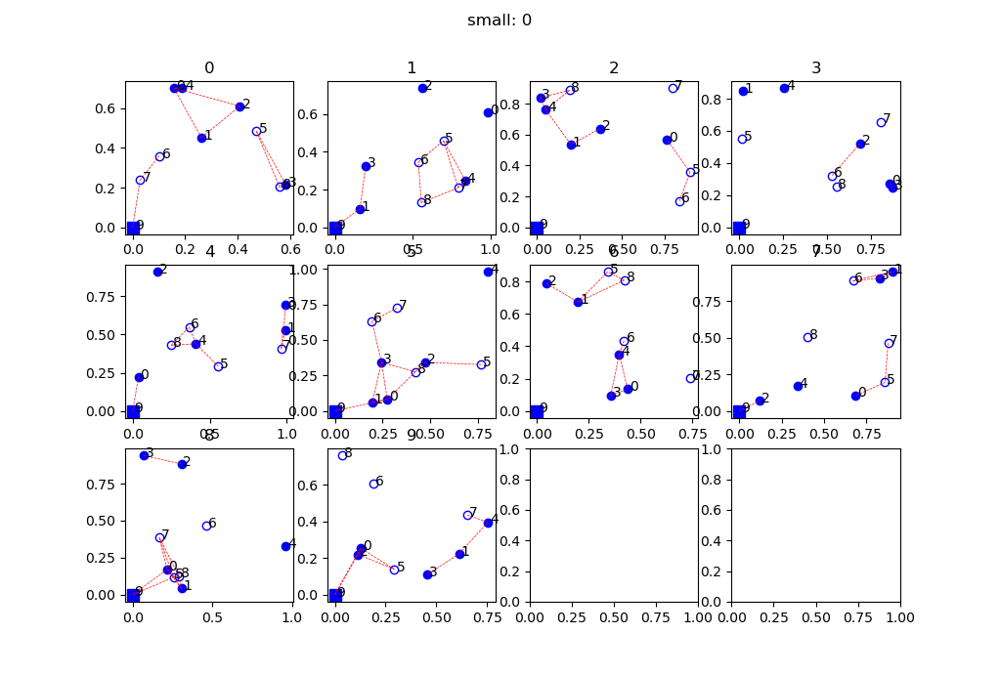
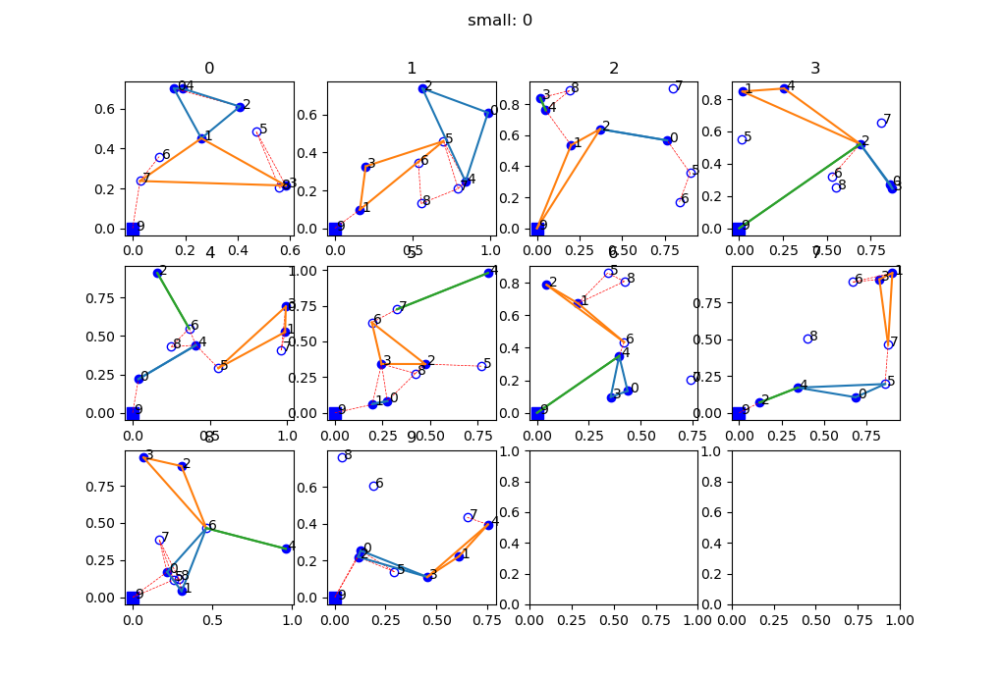
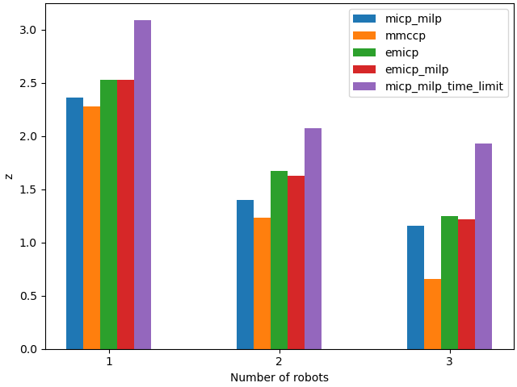

# Min-max vertex cycle covers with connectivity constraints for multi-robot patrolling

This repository contains the code and the data from our paper *Min-max vertex cycle covers with connectivity constraints for multi-robot patrolling*[^1].

[^1]: Juergen Scherer, Angela P. Schoellig, and Bernhard Rinner, *Min-Max Vertex Cycle Covers With Connectivity Constraints for Multi-Robot Patrolling*, IEEE Robotics and Automation Letters, Volume 7, Issue 4, 2022, URL: [https://ieeexplore.ieee.org/abstract/document/9837406](https://ieeexplore.ieee.org/abstract/document/9837406)
## Requirements
### Python environment
The code uses Python 3.9 and requires the packages `networkx`, `scikit-geometry`, and `pyscipopt` (for MILP solving), which can be installed in a Conda environment, for example with: 
```
conda install -c conda-forge networkx=2.6.2
conda install -c conda-forge scikit-geometry=0.1.2
conda install -c conda-forge pyscipopt=3.1.4
```

### MILP solver
To use the algorithms that require solving a Mixed Integer Linear Program (MILP), download and install [SCIP](https://www.scipopt.org/#download)[^2], or (preferably) download and build the parallelized version [fscip](https://www.scipopt.org/download.php?fname=scipoptsuite-7.0.2.tgz) (more information on the [UG website](https://ug.zib.de/), check and modify the file `make_fscip.sh` in the root of this repo). The code in this repo uses `fscip` and runs with the version `7.0.2`.
Change the path in the file `options.json` to point to the `fscip` binaries.

[^2]: Daniel Anderson, Ksenia Bestuzheva, Wei-Kun Chen, Leon Eifler, Gerald Gamrath, Maxime Gasse, Ambros Gleixner, Gregor Hendel, Christopher Hojny, Thorsten Koch, Pierre Le Bodic, Stephen J. Maher, Frederic Matter, Matthias Miltenberger, Marc E. Pfetsch, Felipe Serrano, Dieter Weninger, Jakob Witzig, Patrick Gemander, Leona Gottwald, Katrin Halbig, Erik Mühmer, Benjamin Müller, Franziska Schlösser, Yuji Shinano, Christine Tawfik, Stefan Vigerske, Fabian Wegscheider, *The SCIP Optimization Suite 7.0*, ZIB-Report 20-10, Zuse Institute Berlin, Takustr 7, 14195 Berlin, Germany, 2020, URL: [https://optimization-online.org/?p=16345](https://optimization-online.org/?p=16345)

## Organization of the repository
The scenario configuration files are in the folder `scenarios`, the solutions of the scenario variations in the folder `scenarios/sols` and the results shown in the paper in `paper/data`. All the files in these folders can be regenerated by running the Python scripts described below (the default seed is used to generate the same scenarios, however the solutions of the MILPs may be different due to internal random generators).

## Generating and visualizing scenarios from the paper

The paper contains two scenarios `small` (10 vertices and 1, 2, or 3 robots) and `obs_large` (10, 20, ..., 100 vertices and 2, 4, 6, 8, or 10 robots). The configuration files containing all different variations of each scenario can be generated with (10 scenarios with randomly sampled positions of the vertices will be generated per variation):
```
python generate_scenarios.py --scenario_name small
python generate_scenarios.py --scenario_name obs_large
``` 
This script stores the generated files in the folder `scenarios`. 

To open a plot showing the environments, use:
```
python show_envs.py --scenario_name small 
python show_envs.py --scenario_name obs_large 
```
Use the left and right keys to cycle through all variants for scenario `obs_large` with the different number of vertices. If solutions are availabe, use the arguments e.g. `--create_sols_sub_dir --sol_alg emicp --sol_index 0` to show also the generated tours. `sol_index` refers to the solutions with different number of robots (index starts with 0, e.g. in `small` `0` refers to 1 robot, `1` refers to 2 robots, and `2` refers to 3 robots). `--create_sols_sub_dir` is required if the solutions are also generated with this argument (see below).

|  |  |
|---------------------------------------------|--------------------------------------------------|
| Scenario `small`                            | Scenario `small` with solutions for 3 robots     |

## Solving the problems

To generate the solutions with a specific algorithm, use e.g.:
```
python solve_batch.py --scenario_name small --alg mmccp --create_sols_sub_dir --num_workers 8
python solve_batch.py --scenario_name small --alg emicp --create_sols_sub_dir --num_workers 8
python solve_batch.py --scenario_name small --alg emicp_milp --create_sols_sub_dir --num_workers 1 --solver_params "TimeLimit:10800"
python solve_batch.py --scenario_name small --alg micp_milp --create_sols_sub_dir --num_workers 1 --solver_params "TimeLimit:10800"
```
This script stores the solutions in the folder `scenarios/sols/<scenario_name>/<alg>` (when `--create_sols_sub_dir` is used).

Use the argument `--id N1,N2,...` or `--id :N` or `--id N:` to solve specific scenario variations (numbered from 0 to the number of generated variations minus 1).
`emicp_milp` and `micp_milp` require a MILP solver (see above). These algorithms require `--num_workers 1` because the fscip MILP solver itself is using multiple processors.

## Generating the results files

The following script reads the solutions from the folder `scenarios/sols` and generates the files containing the results shown in the paper (can be read by the [pgfplots](https://www.ctan.org/pkg/pgfplots) package in a Latex document) in the folder `paper/data/`
```
python show_results.py --scenario_name small --create_sols_sub_dir --data_out_dir paper/data/
```

|  |
|------------------------------------------------|
| Results for scenario `small`                   |
